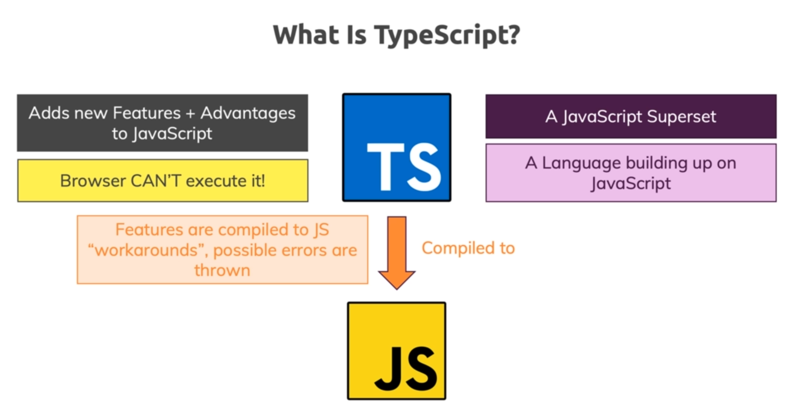
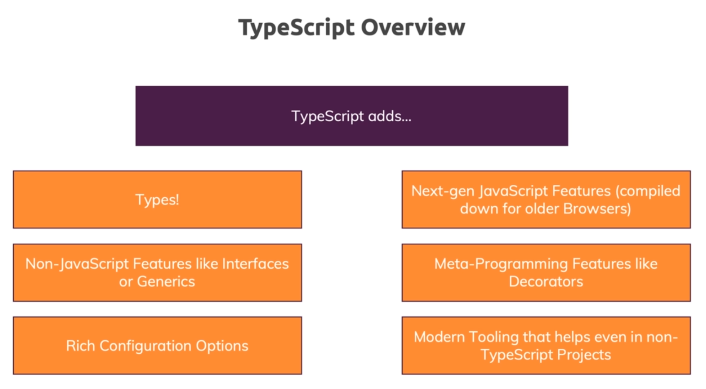
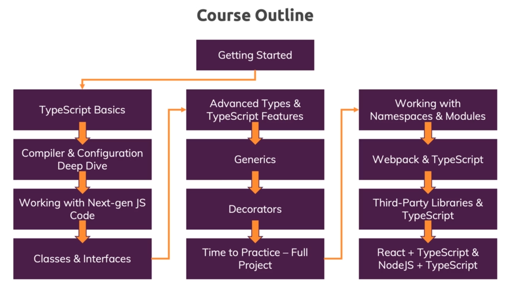
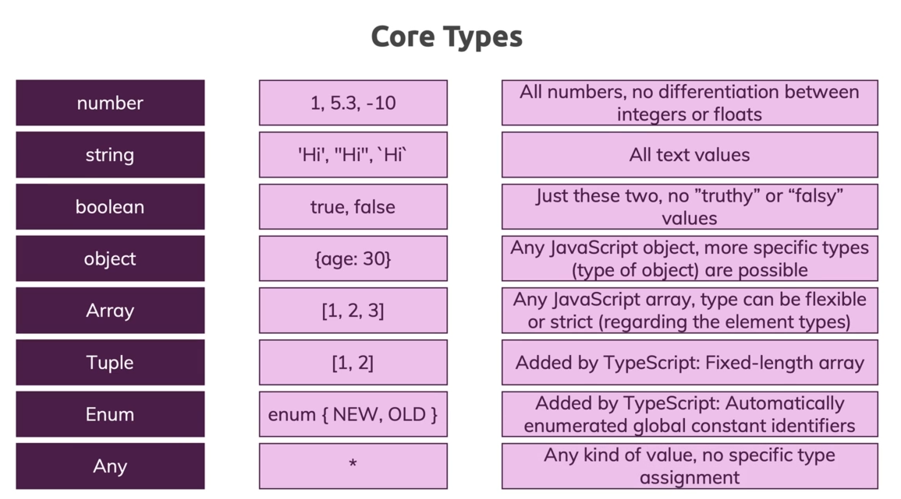
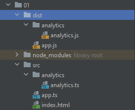
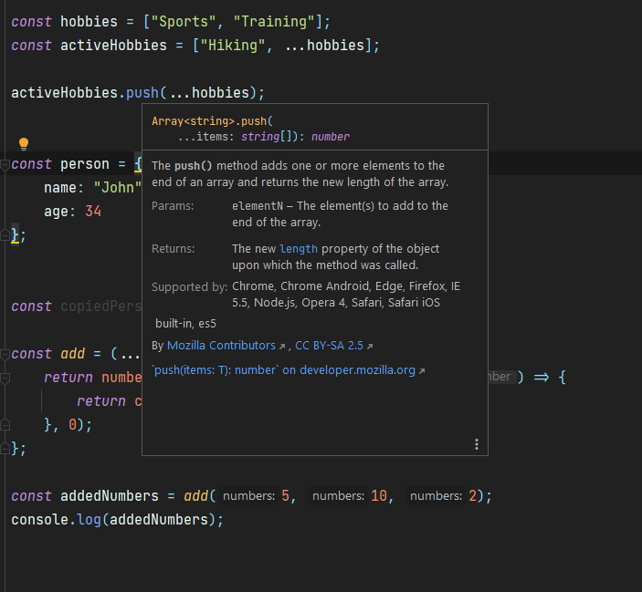
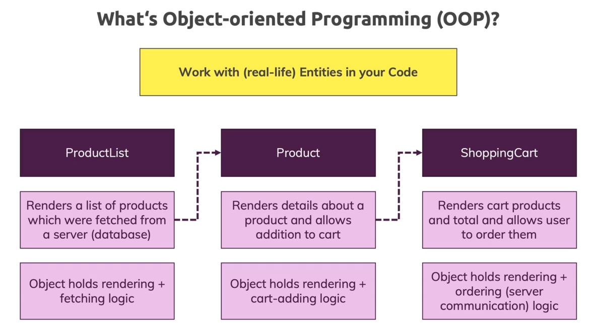
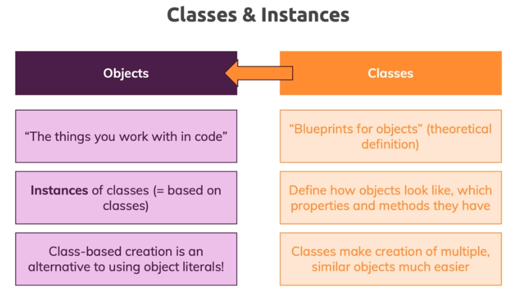
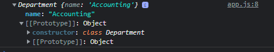

# TypeScript

## Introduction




One of the problems with JavaScript that TypeScript solves is this:

```js
const button = document.querySelector("button");
const input1 = document.getElementById("num1");
const input2 = document.getElementById("num2");

function add(num1, num2) {
  return num1 + num2;
}

button.addEventListener("click",function() {
  console.log(add(input1.value, input2.value));
});
```

Here 10 and 5 can generate 105 instead of 15.

Fixing this we can:

```js
const button = document.querySelector("button");
const input1 = document.getElementById("num1");
const input2 = document.getElementById("num2");

function add(num1, num2) {
  if (typeof num1 === "number" && typeof num2 === "number") {
    return num1 + num2;
  } else {
    return +num1 + +num2;
  }
}

button.addEventListener("click",function() {
  console.log(add(input1.value, input2.value));
});
```

In TypeScript:

```ts 
const button = document.querySelector("button");
const input1 = document.getElementById("num1")! as HTMLInputElement;
const input2 = document.getElementById("num2")! as HTMLInputElement;

function add(num1: number, num2: number) {
    return +num1 + +num2;
}

button.addEventListener("click",function() {
    console.log(add(input1.value, input2.value));
});
```


:::tip
`const input1 = document.getElementById("num1")!;`

The exclamation mark will tell TypeScript that the element will always get found.

`const input1 = document.getElementById("num1")! as HTMLInputElement;`

And we can also use type casting

:::


To execute the file we can 

```
$ tsc using-ts.ts
using-ts.ts:10:21 - error TS2345: Argument of type 'string' is not assignable to parameter of type 'number'.

10     console.log(add(input1.value, input2.value));
                       ~~~~~~~~~~~~


Found 1 error in using-ts.ts:10
```

The error occurred because `.value` always returns a string.

Fixing we have:

```ts
const button = document.querySelector("button");
const input1 = document.getElementById("num1")! as HTMLInputElement;
const input2 = document.getElementById("num2")! as HTMLInputElement;

function add(num1: number, num2: number) {
    return +num1 + +num2;
}

button.addEventListener("click",function() {
    console.log(add(+input1.value, +input2.value));
});
```

:::warning
Important thing is to import the `using-ts.ts` script as `using-ts.js`.
:::

```html {6}
<!DOCTYPE html>
<html lang="en">
<head>
    <meta charset="UTF-8">
    <title>Understand Typescript</title>
    <script src="using-ts.js" defer></script>
</head>
<body>
    <input type="number" id="num1" placeholder="Number 1"/>
    <input type="number" id="num2" placeholder="Number 2"/>
    <button>Add!</button>
</body>
</html>
```

TypeScript's advantages:




## Course Outline 





## Setting up environment

``` 
npm init
npm install --save-dev lite-server
```

package.json file: 

```json
 {
  "name": "understanding-typescript",
  "version": "1.0.0",
  "description": "Understanding TypeScript course",
  "main": "app.js",
  "scripts": {
    "test": "echo \"Error: no test specified\" && exit 1",
    "start": "lite-server --open --host localhost"
  },
  "author": "Thiago Souto",
  "license": "MIT",
  "devDependencies": {
    "lite-server": "^2.6.1"
  }
}
```


## Setting up a second environment

First `npx tsc --init`, to initiate the `tsconfig` file.
Then change the root directory and output director for `src` and `dist`.
A second environment can be set using `npm install ts-node-dev --save-dev`.

And setup some scripts:

```json
"scripts": {
    "dev": "ts-node-dev src/app.ts",
    "build": "tsc"
  },
```

Now we can run `npm run build`


End to erase allthe content from the `dist` folder before creating something we can use `rimraf`.env

```
npm install rimref --save-dev
```

:::tip
`--save-dev` will install development dependencies. `rimraf` for example is not used for production.
:::

and we change the script to use

```json 
"scripts": {
    "dev": "ts-node-dev src/app.ts",
    "build": "rimraf ./dist && tsc"
  },
```

## Setting up ESLint

``` 
npm install --save-dev eslint @typescript-eslint/parser @typescript-eslint/eslint-plugin
```

Then create `.eslintrc`

```json 
{
  "root": true,
  "parser": "@typescript-eslint/parser",
  "plugins": [
    "@typescript-eslint"
  ],
  "extends": [
    "eslint:recommended",
    "plugin:@typescript-eslint/eslint-recommended",
    "plugin:@typescript-eslint/recommended"
  ]
}
```

add `.eslintignore`

```json
node_modules
dist
```

and add a script:

```json 
  "scripts": {
    "dev": "eslint . --ext .ts && ts-node-dev src/app.ts",
    "build": "rimraf ./dist && tsc",
    "start": "npm run build && node dist/app.js",
    "lint": "eslint . --ext .ts"
  },
```

Finally:

Execute the files with `npm run lint && npm run dev` or add lint to `npm eun dev`.


## Prettier 

``` 
 npm install --save-dev prettier
```

```json 
 "scripts": {
    "dev": "eslint . --ext .ts && ts-node-dev src/app.ts",
    "build": "rimraf ./dist && tsc",
    "start": "npm run build && node dist/app.js",
    "lint": "eslint . --ext .ts",
    "format": "prettier --ignore-path .gitignore --write \"**/*.+(js|ts|json)\""

  },
```

## 2 - Using Types

### Core Types





### Working with Numbers, Strings & Booleans


```ts 
function add(n1: number, n2: number, showResult: boolean, phrase: string) {
    const result = n1 + n2;
    if (showResult) {
        console.log(phrase + result)
    } else {
        return result;
    }
}

const number1 = 7;
const number2 = 2.8;
const printResult = true;
const resultPhrase = "Result is: ";

add(number1, number2, printResult, resultPhrase);
```


###  Type Assignment & Type Inference


Type Inference means that TypeScript does its best to undestand which type you have under a variable or constant, like in `const result = n1 + n2;`

We can use: `let number1: number = 7;` but it's not good practice. `let number1: number;` is good practice though.

### Object Types


```ts
const person = {
    name: 'John',
    age: 34
};

console.log(person)
```

We have to add `{}` after the person. This will not create a new javascript object, but this is Typescript notation for specialized object type.

```ts 
const person: {
    name: string;
    age: number;
} = {
    name: 'John',
    age: 34
};

console.log(person)
```

:::tip 
We can do this, but is betterif we let TypeScript infer the type:
```ts
const person = {
    name: 'John',
    age: 34
};

console.log(person)
```
:::


### Array Types

```ts
const person = {
    name: 'John',
    age: 34,
    hobbies: ['Sports', 'Cooking']
};

let favoriteActivity: string[];
let LeastFavoriteActivity: any[];

favoriteActivity = ['Sports'];
LeastFavoriteActivity = ['Swimming', 1];

console.log(person)

for (const hobby of person.hobbies) {
    console.log(hobby.toUpperCase());
}
```

### Working with Tuples

```ts {16-17,2-5}
const person: {
    name: string;
    age: number;
    hobbies: string[];
    role: [number, string];
} = {
    name: 'John',
    age: 34,
    hobbies: ['Sports', 'Cooking'],
    role: [2, 'author']
};

person.role.push('admin'); // works, but is an exception 
person.role.push(0, 'admin'); // works

let favoriteActivity: string[];
let LeastFavoriteActivity: any[];

favoriteActivity = ['Sports'];
LeastFavoriteActivity = ['Swimming', 1];

console.log(person)

for (const hobby of person.hobbies) {
    console.log(hobby.toUpperCase());
}
```

### Working with Enums

Enum can saves us work on this kind of situation:

```ts
const ADMIN = 0;
const READ_ONLY = 0;
const AUTHOR = 0;


const person = {
    name: 'John',
    age: 34,
    hobbies: ['Sports', 'Cooking'],
    role: ADMIN
};

let favoriteActivity: string[];
favoriteActivity = ['Sports'];

console.log(person)

for (const hobby of person.hobbies) {
    console.log(hobby.toUpperCase());
}


if (person.role === ADMIN) {
    console.log("is admin");
}
```
Output:

``` 
{ name: 'John', age: 34, hobbies: [ 'Sports', 'Cooking' ], role: 0 }
SPORTS
COOKING
is admin
```

With `enums` the code would be:

```ts 
enum Role { ADMIN, READ_ONLY, AUTHOR};

const person = {
    name: 'John',
    age: 34,
    hobbies: ['Sports', 'Cooking'],
    role: Role.ADMIN
};

let favoriteActivity: string[];
favoriteActivity = ['Sports'];

console.log(person)

for (const hobby of person.hobbies) {
    console.log(hobby.toUpperCase());
}


if (person.role === Role.ADMIN) {
    console.log("is admin");
}
```

Other examples would be:

```ts 
enum Role { ADMIN = 5, READ_ONLY, AUTHOR};

enum Role { ADMIN = 5, READ_ONLY = 100, AUTHOR = 200};

enum Role { ADMIN = 'ADMIN', READ_ONLY = 100, AUTHOR = 200};
```


### The any Type

```ts
let favoriteActivity: any[];
favoriteActivity = ['Sports'];
```

:::warning
Avoid using the `any` type.
Using only if you really don't know the type you will get.
:::

### Union Types

Used when we accept two different types of values.

```ts 
function combine(input1: number | string, input2: number | string) {
    let result;
    if (typeof input1 === "number" && typeof input2 === "number") {
        result = input1 + input2;
    } else {
        result = input1.toString() + input2.toString();
    }
    return result;
}

const combinedAges = combine(30, 26);
console.log(combinedAges);

const combinedNames = combine("Max", "Anna");
console.log(combinedNames);
```

Output

``` 
56
MaxAnna
```


:::tip
In this case we had to work around with a runtime check, but that's will not always be the case, depending on the operation we are doing.
:::

### Literal Types


Literal types are types that are used when you just don't say that a certain variable or parameter should hold a number or a string, etc, but when **you are very clear the exact value it should hold**

```ts 
function combine(
    input1: number | string,
    input2: number | string,
    resultConversion: string
) {
    let result;
    if (typeof input1 === "number" && typeof input2 === "number") {
        result = input1 + input2;
    } else {
        result = input1.toString() + input2.toString();
    }
    if (resultConversion === "as-number") {
        return + result;
    } else {
        return result.toString();
    }
}

const combinedAges = combine(30, 26, "as-number");
console.log(combinedAges);

const combinedStringAges = combine("30", "26", "as-number");
console.log(combinedStringAges);

const combinedNames = combine("Max", "Anna", "as-text");
console.log(combinedNames);
```

Output:

``` 
56
3026
MaxAnna
```


We can also use a union type combined with a literal type

```ts 
function combine(
    input1: number | string,
    input2: number | string,
    resultConversion: "as-number" | "as-text" | "as-string"
) {
    let result;
    if (typeof input1 === "number" && typeof input2 === "number" || resultConversion === "as-number") {
        result = +input1 + +input2;
    } else {
        result = input1.toString() + input2.toString();
    }
    return result;
}

const combinedAges = combine(30, 26, "as-number");
console.log(combinedAges);

const combinedStringAges = combine("30", "26", "as-number");
console.log(combinedStringAges);

const combinedNames = combine("Max", "Anna", "as-text");
console.log(combinedNames);
```


output:
``` 
56
56
MaxAnna
```

In this case we have a different result because we don't convert the result.


### Type Aliases Custom Types

Top avoid repetition of the union type we can create a new type that stores the union type with the `type` keyword.

```ts{1-2,5-7} 
type Combinable = number | string;
type ConversionDescriptor  = "as-number" | "as-text" | "as-string"

function combine(
    input1: Combinable,
    input2: Combinable,
    resultConversion: ConversionDescriptor
) {
    let result;
    if (typeof input1 === "number" && typeof input2 === "number" || resultConversion === "as-number") {
        result = +input1 + +input2;
    } else {
        result = input1.toString() + input2.toString();
    }
    return result;
}

const combinedAges = combine(30, 26, "as-number");
console.log(combinedAges);

const combinedStringAges = combine("30", "26", "as-number");
console.log(combinedStringAges);

const combinedNames = combine("Max", "Anna", "as-text");
console.log(combinedNames);
```

### Function Return Types & void

Define the type to be returned by the function.

```ts 
function add(n1: number, n2: number): number {
    return n1 + n2;
}

function printResult(num: number): void {
    console.log("Result: " + num);
}

printResult(add(5, 12));
```

:::tip
If we use the return value of a function that doesn't return anything we get `undefined`.
Undefined is also can be a return type, but `return` would be exppected.
```ts 
function printResult(num: number): undefined {
    console.log("Result: " + num);
    return;
}
```

and this would work as well:

```ts 
function printResult(num: number): void {
    console.log("Result: " + num);
    return;
}
```

`undefined` as function return is rarely used.
:::


### Functions as Types

Function types are types that describes a function regarding the parameters and return type of the function.

```ts 
function add(n1: number, n2: number): number {
    return n1 + n2;
}

function printResult(num: number): void {
    console.log("Result: " + num);
}

printResult(add(5, 12));

//'combineValues' is never reassigned. Use 'const' instead  prefer-const
let combineValues: Function;

combineValues = add;

console.log(combineValues(8, 8));
```

```output 
Result: 17
16
```

This runs but gives us the following error:

:::warning ESlint 12:20  error
Don't use `Function` as a type. The `Function` type accepts any function-like value.
It provides no type safety when calling the function, which can be a common source of bugs.
It also accepts things like class declarations, which will throw at runtime as they will not be called with `new`.
If you are expecting the function to accept certain arguments, you should explicitly define the function shape  @typescript-eslint/ban-types
:::

this eliminates that error:

```ts 
function add(n1: number, n2: number): number {
    return n1 + n2;
}

function printResult(num: number): void {
    console.log("Result: " + num);
}

printResult(add(5, 12));

let combineValues: (a: number, b: number) => number;

combineValues = add;
// combineValues = printResult(); this gives us an error

console.log(combineValues(8, 8));
```

but gives us this ESlint error: `14:1  error  'combineValues' is never reassigned. Use 'const' instead  prefer-const`


Finally, this pass:

```ts 
function add(n1: number, n2: number): number {
    return n1 + n2;
}

function printResult(num: number): void {
    console.log("Result: " + num);
}

printResult(add(5, 12));

const combineValues: (a: number, b: number) => number = add;

console.log(combineValues(8, 8));
```


### Function Types & Callbacks

Here we have a new function `addAndHandle` with has a callback function as an argument `cb`, which is called instead of `return`.

```ts 
function add(n1: number, n2: number): number {
    return n1 + n2;
}

function printResult(num: number): void {
    console.log("Result: " + num);
}

function addAndHandle(n1: number, n2: number, cb: (num: number) => void) {
    const result = n1 + n2;
    cb(result);
}

printResult(add(5, 12));

const combineValues: (a: number, b: number) => number = add;

console.log(combineValues(8, 8));

addAndHandle(10, 20, (result) => {
    console.log(result);
})
```

output:

``` 
Result: 17
16
30
```


### The unknown Type

`unknown`  is a bit more restrictive then `any`. With `unknown` we have to first check the type that is currrently stored in `userInput` before we can assign it to `userName`.

```ts 
let userInput: unknown;
let userName: string;

userInput = 5;
userInput = "Max";
userName = userInput; // error here
```

No error here:

```ts 
let userInput: unknown;
let userName: string;

userInput = 5;
userInput = "Max";

if (typeof  userInput === "string") {
    userName = userInput;
}
```

So we need an extra type check with `unknown` to be able to assign an unknown value to a value with a fixed type, and therefore, `unknown` is the better choice over any, when **you don't know what you are going to get but know what you want to do with it after**.


### The never Type

```ts
function generateError(message: string, code: number) {
    throw { message: message, errorCode: code };
}

generateError("An error occurred", 500);
```

``` 
{ message: 'An error occurred', errorCode: 500 }
[ERROR] 11:32:21 Error: An error occurred
```

This function never produces a value it always crashes the script, or this part of the script. So the return type of this function is `never`.

```ts 

function generateError(message: string, code: number): never {
    throw { message: message, errorCode: code };
}

generateError("An error occurred", 500);
```

## The TypeScript Compiler

### Watch mode

To enter watch mode:`tsc app.ts --watch` or `tsc app.ts --w`

### Compiling the Entire Project Multiple Files

We have to create the tsconfig file, with the command: 

``` 
tsc --init
```

Of course `tsc --watch` will now watch all the `ts` files in the folder.


### Including & Excluding Files


Use `exclude` to exclude any directory from the `tsc` commando. Note that `exclude` is a sibling and not a child of `compilerOptions`

```json 
{
  "compilerOptions": {
    /* Visit https://aka.ms/tsconfig.json to read more about this file */

    /* Projects */
    // "incremental": true,                              /* Enable incremental compilation */
    // "composite": true,                                /* Enable constraints that allow a TypeScript project to be used with project references. */
    // "tsBuildInfoFile": "./",                          /* Specify the folder for .tsbuildinfo incremental compilation files. */
    // "disableSourceOfProjectReferenceRedirect": true,  /* Disable preferring source files instead of declaration files when referencing composite projects */
    // "disableSolutionSearching": true,                 /* Opt a project out of multi-project reference checking when editing. */
    // "disableReferencedProjectLoad": true,             /* Reduce the number of projects loaded automatically by TypeScript. */

    /* Language and Environment */
    "target": "es2016" /* Set the Code language version for emitted Code and include compatible library declarations. */,
    // "lib": [],                                        /* Specify a set of bundled library declaration files that describe the target runtime environment. */
    // "jsx": "preserve",                                /* Specify what JSX code is generated. */
    // "experimentalDecorators": true,                   /* Enable experimental support for TC39 stage 2 draft decorators. */
    // "emitDecoratorMetadata": true,                    /* Emit design-type metadata for decorated declarations in source files. */
    // "jsxFactory": "",                                 /* Specify the JSX factory function used when targeting React JSX emit, e.g. 'React.createElement' or 'h' */
    // "jsxFragmentFactory": "",                         /* Specify the JSX Fragment reference used for fragments when targeting React JSX emit e.g. 'React.Fragment' or 'Fragment'. */
    // "jsxImportSource": "",                            /* Specify module specifier used to import the JSX factory functions when using `jsx: react-jsx*`.` */
    // "reactNamespace": "",                             /* Specify the object invoked for `createElement`. This only applies when targeting `react` JSX emit. */
    // "noLib": true,                                    /* Disable including any library files, including the default lib.d.ts. */
    // "useDefineForClassFields": true,                  /* Emit ECMAScript-standard-compliant class fields. */

    /* Modules */
    "module": "commonjs" /* Specify what module code is generated. */,
    "rootDir": "./src" /* Specify the root folder within your source files. */,
    // "moduleResolution": "node",                       /* Specify how TypeScript looks up a file from a given module specifier. */
    // "baseUrl": "./",                                  /* Specify the base directory to resolve non-relative module names. */
    // "paths": {},                                      /* Specify a set of entries that re-map imports to additional lookup locations. */
    // "rootDirs": [],                                   /* Allow multiple folders to be treated as one when resolving modules. */
    // "typeRoots": [],                                  /* Specify multiple folders that act like `./node_modules/@types`. */
    // "types": [],                                      /* Specify type package names to be included without being referenced in a source file. */
    // "allowUmdGlobalAccess": true,                     /* Allow accessing UMD globals from modules. */
    // "resolveJsonModule": true,                        /* Enable importing .json files */
    // "noResolve": true,                                /* Disallow `import`s, `require`s or `<reference>`s from expanding the number of files TypeScript should add to a project. */

    /* Code Support */
    // "allowJs": true,                                  /* Allow Code files to be a part of your program. Use the `checkJS` option to get errors from these files. */
    // "checkJs": true,                                  /* Enable error reporting in type-checked Code files. */
    // "maxNodeModuleJsDepth": 1,                        /* Specify the maximum folder depth used for checking Code files from `node_modules`. Only applicable with `allowJs`. */

    /* Emit */
    // "declaration": true,                              /* Generate .d.ts files from TypeScript and Code files in your project. */
    // "declarationMap": true,                           /* Create sourcemaps for d.ts files. */
    // "emitDeclarationOnly": true,                      /* Only output d.ts files and not Code files. */
    // "sourceMap": true,                                /* Create source map files for emitted Code files. */
    // "outFile": "./",                                  /* Specify a file that bundles all outputs into one Code file. If `declaration` is true, also designates a file that bundles all .d.ts output. */
    "outDir": "./dist" /* Specify an output folder for all emitted files. */,
    // "removeComments": true,                           /* Disable emitting comments. */
    // "noEmit": true,                                   /* Disable emitting files from a compilation. */
    // "importHelpers": true,                            /* Allow importing helper functions from tslib once per project, instead of including them per-file. */
    // "importsNotUsedAsValues": "remove",               /* Specify emit/checking behavior for imports that are only used for types */
    // "downlevelIteration": true,                       /* Emit more compliant, but verbose and less performant Code for iteration. */
    // "sourceRoot": "",                                 /* Specify the root path for debuggers to find the reference source code. */
    // "mapRoot": "",                                    /* Specify the location where debugger should locate map files instead of generated locations. */
    // "inlineSourceMap": true,                          /* Include sourcemap files inside the emitted Code. */
    // "inlineSources": true,                            /* Include source code in the sourcemaps inside the emitted Code. */
    // "emitBOM": true,                                  /* Emit a UTF-8 Byte Order Mark (BOM) in the beginning of output files. */
    // "newLine": "crlf",                                /* Set the newline character for emitting files. */
    // "stripInternal": true,                            /* Disable emitting declarations that have `@internal` in their JSDoc comments. */
    // "noEmitHelpers": true,                            /* Disable generating custom helper functions like `__extends` in compiled output. */
    // "noEmitOnError": true,                            /* Disable emitting files if any type checking errors are reported. */
    // "preserveConstEnums": true,                       /* Disable erasing `const enum` declarations in generated code. */
    // "declarationDir": "./",                           /* Specify the output directory for generated declaration files. */
    // "preserveValueImports": true,                     /* Preserve unused imported values in the Code output that would otherwise be removed. */

    /* Interop Constraints */
    // "isolatedModules": true,                          /* Ensure that each file can be safely transpiled without relying on other imports. */
    // "allowSyntheticDefaultImports": true,             /* Allow 'import x from y' when a module doesn't have a default export. */
    "esModuleInterop": true /* Emit additional Code to ease support for importing CommonJS modules. This enables `allowSyntheticDefaultImports` for type compatibility. */,
    // "preserveSymlinks": true,                         /* Disable resolving symlinks to their realpath. This correlates to the same flag in node. */
    "forceConsistentCasingInFileNames": true /* Ensure that casing is correct in imports. */,

    /* Type Checking */
    "strict": true /* Enable all strict type-checking options. */,
    // "noImplicitAny": true,                            /* Enable error reporting for expressions and declarations with an implied `any` type.. */
    // "strictNullChecks": true,                         /* When type checking, take into account `null` and `undefined`. */
    // "strictFunctionTypes": true,                      /* When assigning functions, check to ensure parameters and the return values are subtype-compatible. */
    // "strictBindCallApply": true,                      /* Check that the arguments for `bind`, `call`, and `apply` methods match the original function. */
    // "strictPropertyInitialization": true,             /* Check for class properties that are declared but not set in the constructor. */
    // "noImplicitThis": true,                           /* Enable error reporting when `this` is given the type `any`. */
    // "useUnknownInCatchVariables": true,               /* Type catch clause variables as 'unknown' instead of 'any'. */
    // "alwaysStrict": true,                             /* Ensure 'use strict' is always emitted. */
    // "noUnusedLocals": true,                           /* Enable error reporting when a local variables aren't read. */
    // "noUnusedParameters": true,                       /* Raise an error when a function parameter isn't read */
    // "exactOptionalPropertyTypes": true,               /* Interpret optional property types as written, rather than adding 'undefined'. */
    // "noImplicitReturns": true,                        /* Enable error reporting for codepaths that do not explicitly return in a function. */
    // "noFallthroughCasesInSwitch": true,               /* Enable error reporting for fallthrough cases in switch statements. */
    // "noUncheckedIndexedAccess": true,                 /* Include 'undefined' in index signature results */
    // "noImplicitOverride": true,                       /* Ensure overriding members in derived classes are marked with an override modifier. */
    // "noPropertyAccessFromIndexSignature": true,       /* Enforces using indexed accessors for keys declared using an indexed type */
    // "allowUnusedLabels": true,                        /* Disable error reporting for unused labels. */
    // "allowUnreachableCode": true,                     /* Disable error reporting for unreachable code. */

    /* Completeness */
    // "skipDefaultLibCheck": true,                      /* Skip type checking .d.ts files that are included with TypeScript. */
    "skipLibCheck": true /* Skip type checking all .d.ts files. */
  },
  "exclude": [
    "node_modules",
    "TypeScript Basics & Basic Types/*"
  ]
}
```
Examples

```json
"exclude": [
    "analytics.ts", //exclude only this file
    "*.dev.ts", // Exclude all dev.ts fiels in this directory
    "**/*.dev.ts", // Any file with that pattern in any folder
    "node_modules" // node modules are excluded by default
  ]
```
The include do the oposite it includes only what is listed.

This will include only `app.ts`.

```json
"include": [
  "app.ts"
]
```

`exlude` when used together with `include` will filter down the `include`.

Basically we compile `include` - `exclude`.


the option `files` specify files to be included, and differs from `include` because in `files` you cannot include folders.

```json
"files": [
  "app.ts"
]
```


### Setting a Compilation Target

Choose the version of JavaScript you want to compile to.

``` 
"target": "es2016" /* Set the JavaScript language version for emitted JavaScript and include compatible library declarations. */,
```
 
### Understanding TypeScript core libraries


Let's have a button:

```html 
<!doctype html>
<html lang="en">
<head>
    <meta charset="UTF-8">
    <meta name="viewport"
          content="width=device-width, user-scalable=no, initial-scale=1.0, maximum-scale=1.0, minimum-scale=1.0">
    <meta http-equiv="X-UA-Compatible" content="ie=edge">
    <title>Understand Typescript</title>
    <script src="../dist/app.js" defer></script>
    <script src="../dist/analytics.js" defer></script>
</head>
<body>
    <button>Click Me</button>
</body>
</html>
```

and an event listener:

```ts 
const button = document.querySelector("button")!;

button.addEventListener("click", () => {
    console.log("Clicked!!");
});
```

This will compile, dispite that we didn't define anything in the html.
That's because the `lib[]` options default settings on the `tsconfig` file.
If it is not set, all the features that is available on ES2016 in this case will be available, like `Map()`, and the `DOM API`.
If it is set we will have to specify the libraries. like so:

```json
"lib": [
   "dom".
    "es6",
    "dom.iterable",
    "scripthost",
 ],  
```

These are the libraries specified in the default settings.

### More Configuration & Compilation Options

`allowJs` will compile `.js` files and `checkJs` will check but not compile.

```json 
"allowJs": true,                                  /* Allow JavaScript files to be a part of your program. Use the `checkJS` option to get errors from these files. */
"checkJs": true,                                  /* Enable error reporting in type-checked JavaScript files. */
```

### Working with Source Maps

Source map helps us with debugging and development. They create `.js.map` files that work as a Bridge to connect the javascript files to the input files, `ts`.


```json 
"sourceMap": true,                                /* Create source map files for emitted JavaScript files. */
```

### rootDir and outDir

```json 
"rootDir": "./src" /* Specify the root folder within your source files. */,
"outDir": "./dist" /* Specify an output folder for all emitted files. */,
```

We have to adjust the script tag on the html. 

```html{9-10}
<!doctype html>
<html lang="en">
<head>
    <meta charset="UTF-8">
    <meta name="viewport"
          content="width=device-width, user-scalable=no, initial-scale=1.0, maximum-scale=1.0, minimum-scale=1.0">
    <meta http-equiv="X-UA-Compatible" content="ie=edge">
    <title>Understand Typescript</title>
    <script src="dist/app.js" defer></script>
    <script src="dist/analytics.js" defer></script>
</head>
<body>
    <button>Click Me</button>
</body>
</html>
```

If we have a Directory hierarchy it will be compiled with the hierarchical structure.





`removeComments` don't compile comments, `noEmit` will just check and don't compile the files, and `downlevelIteration` is used when compiling to older JavaScript that generates loops problems, but It is verbose.


```json 
"removeComments": true,                           /* Disable emitting comments. */
"noEmit": true,                                   /* Disable emitting files from a compilation. */
"downlevelIteration": true,                       /* Emit more compliant, but verbose and less performant JavaScript for iteration. */
```


### Stop Emitting Files on Compilation Errors

It's false by default, but when set to true, it will not generate the compiled files when there is an error.

```json 
"noEmitOnError": false,
```

### Strict compilation

This will enable all strict type-checking options
```json 
"strict": true /* Enable all strict type-checking options. */,
```

Here are other options available:

```json 
// "noImplicitAny": true,                            /* Enable error reporting for expressions and declarations with an implied `any` type.. */
// "strictNullChecks": true,                         /* When type checking, take into account `null` and `undefined`. */
// "strictFunctionTypes": true,                      /* When assigning functions, check to ensure parameters and the return values are subtype-compatible. */
// "strictBindCallApply": true,                      /* Check that the arguments for `bind`, `call`, and `apply` methods match the original function. */
// "strictPropertyInitialization": true,             /* Check for class properties that are declared but not set in the constructor. */
// "noImplicitThis": true,                           /* Enable error reporting when `this` is given the type `any`. */
// "useUnknownInCatchVariables": true,               /* Type catch clause variables as 'unknown' instead of 'any'. */
// "alwaysStrict": true,                             /* Ensure 'use strict' is always emitted. */
// "noUnusedLocals": true,                           /* Enable error reporting when a local variables aren't read. */
// "noUnusedParameters": true,                       /* Raise an error when a function parameter isn't read */
// "exactOptionalPropertyTypes": true,               /* Interpret optional property types as written, rather than adding 'undefined'. */
// "noImplicitReturns": true,                        /* Enable error reporting for codepaths that do not explicitly return in a function. */
// "noFallthroughCasesInSwitch": true,               /* Enable error reporting for fallthrough cases in switch statements. */
// "noUncheckedIndexedAccess": true,                 /* Include 'undefined' in index signature results */
// "noImplicitOverride": true,                       /* Ensure overriding members in derived classes are marked with an override modifier. */
// "noPropertyAccessFromIndexSignature": true,       /* Enforces using indexed accessors for keys declared using an indexed type */
// "allowUnusedLabels": true,                        /* Disable error reporting for unused labels. */
// "allowUnreachableCode": true,                     /* Disable error reporting for unreachable code. */
```

## Next-generation JavaScript & TypeScript

### `let` and `const`

The difference between `let` and `const` is that `const` cannot be changed.


Why let was introduced? The reason is **the scope in which this variable is available**.

`var` have a **global** and a **function** scope.


This will work on JavaScript but will generate an error on TypeScript. In this case, for JavaScript, this is a global variable.

```ts 
const userName = "Max";

let age = 30;

age = 29;

function add(a: number, b: number) {
    var result;
    result = a + b;
    return result;
}

if (age > 30) {
    var isOld = true;
}

console.log(isOld);
```

with:

```ts 
if (age > 30) {
    let isOld = true;
}
```

this variable is only available inside the curly braces.

`let` and `const` introduced `block scope`. Which means a `variable` or `const` is always available in the block in which its defined or in any lower blocks, a block is a snippet surrounded by curly braces.


### Arrow Functions 


```ts 
const add = (a: number, b: number) => {
    return a + b;
}

console.log(add(2, 5));
```
if you only have **one expression** you can write it like this:

```ts 
const add = (a: number, b: number) => a + b;

console.log(add(2, 5));
```

If you have a function that only takes **one parameter** we can write this:

```ts 
const add = (a: number, b: number) => a + b;

console.log(add(2, 5));

const printOutput = (output: string | number) => {
    console.log(output);
}

printOutput(add(5, 2));
```

like this:

```ts{5}
const add = (a: number, b: number) => a + b;

console.log(add(2, 5));

const printOutput: (a: string | number) => void = output => console.log(output);

printOutput(add(5, 2));
```

or this:

```ts  
const add = (a: number, b: number) => a + b;

console.log(add(2, 5));

const printOutput: (a: string | number) => void = output => console.log(output);

const button = document.querySelector("button");

if (button) {
    button.addEventListener("click", event => console.log(event));
}

printOutput(add(5, 2));
```


### Default Function Parameters

We can assign default arguments to function parameters. Note that we called the function with one argument only.

```ts{1,11}
const add = (a: number, b: number = 1) => a + b;

const printOutput: (a: string | number) => void = output => console.log(output);

const button = document.querySelector("button");

if (button) {
    button.addEventListener("click", event => console.log(event));
}

printOutput(add(5));
```

:::warning 
Default values have to be set in the last argument, `const add = (a: number = 1, b: number) => a + b;` this doesn't work.
:::
s

### The Spread Operator (...)

It tells javascript to pull out all the elements of the array and basically add them as a list of values, not as an array but a list of individual values, in the place where you used the operator. In this case `push`.

```ts 
const hobbies = ["Sports", "Training"];
const activeHobbies = ["Hiking"];

activeHobbies.push(...hobbies);
```

or 

```ts 
const activeHobbies = ["Hiking", ...hobbies];
```

it also exists in objects. To make a copy we create a new object with the curly braces, and then we use the spread operator. This will create a perfcect copy of the original object. 

```ts
const person = {
    name: "John",
    age: 34
};

const copiedPerson = { ...person };
```

### Rest Parameters

When do you expect a list of values, and you may not know the amount of values we can use `...numbers` for example, as a parameter of a function. 
It will merge all incoming parameters or the incoming list of values into an **array**,


```ts 
const add = (...numbers: number[]) => {
    return numbers.reduce((curResult, curValue) => {
        return curResult + curValue;
    }, 0);
};

const addedNumbers = add(5, 10, 2, 3.7);
console.log(addedNumbers);
```
output:

``` 
20.7
```

:::tip reduce
`reduce` works performing an operation on every element in an array, returns a result, and adds these results together. 
For that you provide a function to `reduce`, and then a starting value (0 in this case), and the function that you pass to reduce itself takes 2 values (`curResult` and `curValue`)
:::

It can be combined with tuples as well. When you want to support multiple arguments, but you know how many it will be.

```ts 
const add = (...numbers: [number, number, number]) => {
    return numbers.reduce((curResult, curValue) => {
        return curResult + curValue;
    }, 0);
};

const addedNumbers = add(5, 10, 2);
console.log(addedNumbers);
```

The `push` method works exactly that way with rest operators.




### Array & Object Destructuring

Let's suppose we want to get the hobbies out of the `hobbies` const.

we can do like this:

```ts 
const hobby1 = hobbies[0]
const hobby2 = hobbies[1]
```

or we can use an array destructuring.

```ts 
const [hobby1, hobby2] = hobbies;
```
We can also store the remaining, if there are any, in rest parameters.

```ts 
const [hobby1, hobby2, ...remainingHobbies] = hobbies;
```

Destructuring does not change the original array, and it works with `const` and `let`.


We can use for objects, but because the order is not guaranteed we pull object per keys and not per position.
Then they are pulled ins constants or variables of the same name.


```ts
const person = {
    firstName: "John",
    age: 34
};

const { firstName, age} = person;
```

we can also name the variables differently:

```ts
const person = {
    firstName: "John",
    age: 34
};

const { firstName: userName, age} = person;

console.log(userName, age, person);
```
output:

```bash 
John 34 { firstName: 'John', age: 34 }
```


## Classes








### Creating a First Class

The convention is to start a class name with Uppercase letter. Functions and objects are called `methods`.

```ts 
class Department {
    name: string;

    constructor(n: string) {
        this.name = n;
    }
}

const accounting = new Department("Accounting");

console.log(accounting);
```

output:

```bash
Department { name: 'Accounting' }
```




### Compiling to JavaScript

es6 style with class is almost the same as in typescript for this case:

```js 
"use strict";
class Department {
    constructor(n) {
        this.name = n;
    }
}
const accounting = new Department("Accounting");
console.log(accounting);
```

The es5 on the other hand uses a `Constructor Function`

```js 
"use strict";
var Department = (function () {
    function Department(n) {
        this.name = n;
    }
    return Department;
}());
var accounting = new Department("Accounting");
console.log(accounting);
```


### Constructor Functions & The `this` Keyword

`this` normally refers back to the concrete instance of this class. 
`accounting.describe()` will reffer to the concrete object that was created by the class.

```ts 
"use strict";
class Department {
    constructor(n) {
        this.name = n;
    }

    describe() {
        console.log("Department: " + this.name);
    }
}
const accounting = new Department("Accounting");

accounting.describe();
```

:::tip 
Normally `this` will refer to the thing in front of the `.`.

Like in here:

```ts 
const accountingCopy = { describe: accounting.describe };

accountingCopy.describe();
```
In this case `accountingCopy` is referring to the method `describing` and will give us back an undefined object, 
because `accountingCopy`has no `name` property.

output: 

```bash 
Department: Accounting
Department: undefined
```


A workaround is to define `this` inside the method. In this case `this` inside of `describe` should always refer to an instance that is based on the `Depoartment class`.
```ts 
class Department {
    name: string;

    constructor(n: string) {
        this.name = n;
    }

    describe(this: Department) {
        console.log("Department: " + this.name);
    }
}
const accounting = new Department("Accounting");

accounting.describe();

const accountingCopy = { name: "DUMMY", describe: accounting.describe };

accountingCopy.describe();
```

output:

```bash 
Department: Accounting
Department: DUMMY
```
:::


### `private` and `public` Access Modifiers

A little more elaborate class: 

```ts 
class Department {
    name: string;
    employees: string[] = [];

    constructor(n: string) {
        this.name = n;
    }

    describe(this: Department) {
        console.log("Department: " + this.name);
    }

    addEmployee(employee: string) {
        this.employees.push(employee);
    }

    printEmployeeInformation() {
        console.log(this.employees.length);
        console.log(this.employees);
    }
}

const accounting = new Department("Accounting");

accounting.addEmployee("Max");
accounting.addEmployee("Thiago");

accounting.describe();
accounting.printEmployeeInformation();
```


we can also add an employee with `accounting.employees[2] = "Anna";`. 
But you may not want to have many ways to enter an employee in a big team, for inconsistency, or because you do have more operation on the `addEmployee` method. Validation for instance.


So you can turn employee into a private property, by adding the private keyword in front of it.

now the code gives an error:

```bash
src/app.ts:28:12 - error TS2341: Property 'employees' is private and only accessible within class 'Department'.
                                                                                                               
28 accounting.employees[2] = "Anna";                                                                           
              ~~~~~~~~~                                                                                        
```

And I can make the name property accessible by making it `public`, and assign a new name.

```ts 
class Department {
    public name: string;
    private employees: string[] = [];

    constructor(n: string) {
        this.name = n;
    }

    describe(this: Department) {
        console.log("Department: " + this.name);
    }

    addEmployee(employee: string) {
        this.employees.push(employee);
    }

    printEmployeeInformation() {
        console.log(this.employees.length);
        console.log(this.employees);
    }
}

const accounting = new Department("Accounting");

accounting.addEmployee("Max");
accounting.addEmployee("Thiago");

// accounting.employees[2] = "Anna";

accounting.describe();
accounting.name = "New name"
accounting.printEmployeeInformation();
```

output:

```bash 
Department: Accounting
2
[ 'Max', 'Thiago' ]
```


### Shorthand Initialization

This is simple a shortcut for the double initialization where we have to find your fields and then store the value, now where we doing all in one go.


instead of this:

```ts 
private id: string;
private name: string;
private employees: string[] = [];

constructor(id: string, n: string) {
    this.name = n;
}
```

we have:

```ts 
class Department {
    private employees: string[] = [];

    constructor(private id: string, public name: string) {}

    describe(this: Department) {
        console.log(`Department (${this.id}): ${this.name}`);
    }

    addEmployee(employee: string) {
        this.employees.push(employee);
    }

    printEmployeeInformation() {
        console.log(this.employees.length);
        console.log(this.employees);
    }
}

const accounting = new Department("d1","Accounting");

accounting.addEmployee("Max");
accounting.addEmployee("Thiago");

accounting.describe();
accounting.name = "New name"
accounting.printEmployeeInformation();
```
output:

```bash 
Department (d1): Accounting
2
[ 'Max', 'Thiago' ]
```

So for every argument that has an access modifier (`public` or `private`) in front of it, a property of the same name is created, and the value of the argument is stored in that created property.


:::tip
JavaScript template literals require backticks (``), not straight quotation marks(`''`).
:::


### `readonly` Properties

It can be initialized and then not changed anymore.

``` 
constructor(private readonly id: string, public name: string) {}
```


### Inheritance

There might be some base properties that all departments should have, but some will need additional properties.
So we can inherit from **one** class.


We can create a new ITDepartment even if the class is empty, because it inherited all even the constructor.

```ts  
class ITDepartment extends Department {

}
const accounting = new ITDepartment("d1","Accounting");
```

Whenever you have your own constructor in a class that inherit from another class you have to use `super`.
`super` calls for the constructor of the base class.


```ts 
class ITDepartment extends Department {
    constructor(id: string, public admins: string[]) {
        super(id, "IT");
    }
}
```

If you are using the `this` keyword, you have to use after the `super`

```ts  
class ITDepartment extends Department {
    admins: string[];
    constructor(id: string, admins: string[]) {
        super(id, "IT");
        this.admins = admins;
    }
}

const it = new ITDepartment("d1",["Max"]);

it.addEmployee("Max");
it.addEmployee("Thiago");
it.describe();
it.name = "New name"
it.printEmployeeInformation();

console.log(it);
```

output:

```bash 
Department (d1): IT
2
[ 'Max', 'Thiago' ]
ITDepartment {
  id: 'd1',
  name: 'New name',
  employees: [ 'Max', 'Thiago' ],
  admins: [ 'Max' ]
}

```

Now let's make an accounting department:

```ts 
...
class AccountingDepartment extends Department {
    constructor(id: string, private reports: string[]) {
        super(id, "Accounting");
    }

    addReport(text: string) {
        this.reports.push(text);
    }

    printReports() {
        console.log(this.reports);
    }
}

const it = new ITDepartment("d1",["Max"]);

it.addEmployee("Max");
it.addEmployee("Thiago");
it.describe();
it.name = "New name"
it.printEmployeeInformation();

console.log(it);


const accounting = new AccountingDepartment('d2', []);

accounting.addReport("Something went wrong");

accounting.printReports();
```


output:

```bash 
Department (d1): IT
2
[ 'Max', 'Thiago' ]
ITDepartment {
  id: 'd1',
  name: 'New name',
  employees: [ 'Max', 'Thiago' ],
  admins: [ 'Max' ]
}
[ 'Something went wrong' ]
```

### Overriding Properties & The protected Modifier

Let's add our own `addEmployee` method in `accounting`.
Private properties are only accessible inside the class that they are defined. So we have to use protected on `employees`. Protected is like private but unlike private It's not just available in the class but also in the inheritance.

```ts 
...
protected employees: string[] = [];
...
addEmployee(name: string) {
    if (name === "Max") {
        return
    }
    this.employees.push(name);
}
```


### Getters & Setters

Let's set up a `private` last report, which will be set to `reports[0];` in the constructor, and will be filled with `text` in the `addReport` function.

```ts 
class AccountingDepartment extends Department {
    private lastReport: string;

    constructor(id: string, private reports: string[]) {
        super(id, "Accounting");
        this.lastReport = reports[0];
    }

    addEmployee(name: string) {
        if (name === "Max") {
            return
        }
        this.employees.push(name);
    }

    addReport(text: string) {
        this.reports.push(text);
        this.lastReport = text;
    }

    printReports() {
        console.log(this.reports);
    }
}
```

because `lastReport` is `private` we need a getter to access it.

```ts  
get mostRecentReport() {
    if (this.lastReport) {
        return this.lastReport;
    }
    throw new Error("No report found.");
}
```

and we can call it here:

```ts 
accounting.addReport("Something went wrong");

console.log(accounting.mostRecentReport); //no parenthesis needed here
```

The setter is almost the same, but it has to have an argument.

```ts  
set mostRecentReport(value: string) {
    if (!value) {
        throw new Error("Please pass in a value.");
    }
    this.addReport(value);
}
```

We call the setter by using the equal sign operator. 

```ts 
accounting.mostRecentReport = "Year End Report";
```

output:

```bash 
[ 'Year End Report', 'Something went wrong' ]
```

Full code:

```ts 
class Department {
    protected employees: string[] = [];

    constructor(private readonly id: string, public name: string) {}

    describe(this: Department) {
        console.log(`Department (${this.id}): ${this.name}`);
    }

    addEmployee(employee: string) {
        this.employees.push(employee);
    }

    printEmployeeInformation() {
        console.log(this.employees.length);
        console.log(this.employees);
    }
}

class ITDepartment extends Department {
    admins: string[];
    constructor(id: string, admins: string[]) {
        super(id, "IT");
        this.admins = admins;
    }
}


class AccountingDepartment extends Department {
    private lastReport: string;

    get mostRecentReport() {
        if (this.lastReport) {
            return this.lastReport;
        }
        throw new Error("No report found.");
    }

    set mostRecentReport(value: string) {
        if (!value) {
            throw new Error("Please pass in a value.");
        }
        this.addReport(value);
    }

    constructor(id: string, private reports: string[]) {
        super(id, "Accounting");
        this.lastReport = reports[0];
    }

    addEmployee(name: string) {
        if (name === "Max") {
            return
        }
        this.employees.push(name);
    }

    addReport(text: string) {
        this.reports.push(text);
        this.lastReport = text;
    }

    printReports() {
        console.log(this.reports);
    }
}

const it = new ITDepartment("d1",["Max"]);

it.addEmployee("Max");
it.addEmployee("Thiago");
it.describe();
it.name = "New name"
it.printEmployeeInformation();

console.log(it);


const accounting = new AccountingDepartment('d2', []);

accounting.mostRecentReport = "Year End Report";

accounting.addReport("Something went wrong");

console.log(accounting.mostRecentReport); //no parenthesis needed here

accounting.printReports();
```


### Static Methods & Properties


This allows you to add static methods and properties to classes, which are not accessed on an instance of the class, you don't need to call `new` first, you access directly from the class.

an example is the `Math` class, which is globally available in javascript.

```ts
 Math.pow();
```

Let's create a static method to create an employee, in the Department class.

```ts{6-8}
class Department {
    protected employees: string[] = [];

    constructor(private readonly id: string, public name: string) {}
    
    static createEmployee (name: string) {
        return {name: name};
    }

    describe(this: Department) {
        console.log(`Department (${this.id}): ${this.name}`);
    }

    addEmployee(employee: string) {
        this.employees.push(employee);
    }

    printEmployeeInformation() {
        console.log(this.employees.length);
        console.log(this.employees);
    }
}
```

To use that:

```ts 
const employee1 = Department.createEmployee("Thiago");
console.log(employee1);
```
output:

```bash
{ name: 'Thiago' }
```


We can also add a static property. 

```ts{2}
class Department {
    static fiscalYear = 2020
    protected employees: string[] = [];

    constructor(private readonly id: string, public name: string) {}

    static createEmployee (name: string) {
        return {name: name};
    }

    describe(this: Department) {
        console.log(`Department (${this.id}): ${this.name}`);
    }

    addEmployee(employee: string) {
        this.employees.push(employee);
    }

    printEmployeeInformation() {
        console.log(this.employees.length);
        console.log(this.employees);
    }
}
```

and call it here:"

```ts 
console.log(employee1, Department.fiscalYear);
```
output:

```bash
{ name: 'Thiago' } 2020
```

:::warning
We cannot use static properties from inside the class, because the whole idea of static is that it is detached from the instance. And `this` refers to the instance

```ts 
constructor(private readonly id: string, public name: string) {
        console.log(this.fiscalYear);
    }
```
To use inside the class we have to use the class name itself 


```ts 
constructor(private readonly id: string, public name: string) {
        console.log(Department.fiscalYear);
    }
```
:::

### Abstract Classes

First lets create an `decribe` method in the `AccountingDepartment` which is inherited from the `Department` class.

Let's turn the `id` property into protected so it can be available in the classes that inherit from the `Department` class.


`Department` class

```ts 
class Department {
    static fiscalYear = 2020
    protected employees: string[] = [];

    constructor(protected readonly id: string, public name: string) {
        console.log(Department.fiscalYear);
    }
...
```
`AccountingDepartment` class

```ts 
describe() {
        console.log("Accounting department - ID: " + this.id);
    }
```
Calling the method with:

```ts 
accounting.describe();
```

When we want that a certain method is implemented in the inheriting class. With the `abstract` method on the base class, it will force all the inheriting classes to add and override the `abstract` method.


You then cannot implement the `abstract` method on the base function, instead you have to add a `:` and the returning type.

```ts{13}
abstract class Department {
    static fiscalYear = 2020
    protected employees: string[] = [];

    constructor(protected readonly id: string, public name: string) {
        console.log(Department.fiscalYear);
    }

    static createEmployee (name: string) {
        return {name: name};
    }

    abstract describe(this: Department): void;

    addEmployee(employee: string) {
        this.employees.push(employee);
    }

    printEmployeeInformation() {
        console.log(this.employees.length);
        console.log(this.employees);
    }
}
```

Now we have to implement the `describe` method in the `ITDepartment` class as well, because it extends `Department`.


```ts 
abstract class Department {
    static fiscalYear = 2020
    protected employees: string[] = [];

    constructor(protected readonly id: string, public name: string) {
        console.log(Department.fiscalYear);
    }

    static createEmployee (name: string) {
        return {name: name};
    }

    abstract describe(this: Department): void;

    addEmployee(employee: string) {
        this.employees.push(employee);
    }

    printEmployeeInformation() {
        console.log(this.employees.length);
        console.log(this.employees);
    }
}

class ITDepartment extends Department {
    admins: string[];
    constructor(id: string, admins: string[]) {
        super(id, "IT");
        this.admins = admins;
    }

    describe() {
        console.log("IT department - ID: " + this.id);
    }
}


class AccountingDepartment extends Department {
    private lastReport: string;

    get mostRecentReport() {
        if (this.lastReport) {
            return this.lastReport;
        }
        throw new Error("No report found.");
    }

    set mostRecentReport(value: string) {
        if (!value) {
            throw new Error("Please pass in a value.");
        }
        this.addReport(value);
    }

    constructor(id: string, private reports: string[]) {
        super(id, "Accounting");
        this.lastReport = reports[0];
    }

    describe() {
        console.log("Accounting department - ID: " + this.id);
    }

    addEmployee(name: string) {
        if (name === "Max") {
            return
        }
        this.employees.push(name);
    }

    addReport(text: string) {
        this.reports.push(text);
        this.lastReport = text;
    }

    printReports() {
        console.log(this.reports);
    }
}

const employee1 = Department.createEmployee("Thiago");
console.log(employee1, Department.fiscalYear);

const it = new ITDepartment("d1",["Max"]);

it.addEmployee("Max");
it.addEmployee("Thiago");
it.describe();
it.name = "New name"
it.printEmployeeInformation();

console.log(it);


const accounting = new AccountingDepartment('d2', []);

accounting.mostRecentReport = "Year End Report";

accounting.addReport("Something went wrong");

console.log(accounting.mostRecentReport); //no parenthesis needed here

// accounting.printReports();

accounting.describe();
```
output:

```bash{1,12}
IT department - ID: d1
2
[ 'Max', 'Thiago' ]
ITDepartment {
  id: 'd1',
  name: 'New name',
  employees: [ 'Max', 'Thiago' ],
  admins: [ 'Max' ]
}
2020
Something went wrong
Accounting department - ID: d2
```

:::warning
Now `Department` cannot be instantiated. because it is an abstract class. Instead, we have to instantiate the class that inherit from the `Department` class and provide a concrete implementation of the abstract methods.
:::


### Singletons & Private Constructors

Private Constructors are used to create singletons, which are design pattern where you can only have one instance of a class.
We can access the class with `static methods`.

Let's suppose we can only have one accounting department.


```ts 
class AccountingDepartment extends Department {
    private lastReport: string;
    private static instance: AccountingDepartment;

    get mostRecentReport() {
        if (this.lastReport) {
            return this.lastReport;
        }
        throw new Error("No report found.");
    }

    set mostRecentReport(value: string) {
        if (!value) {
            throw new Error("Please pass in a value.");
        }
        this.addReport(value);
    }

    private constructor(id: string, private reports: string[]) {
        super(id, "Accounting");
        this.lastReport = reports[0];
    }

    static getInstance () {
        if (AccountingDepartment.instance) {   // if (this.instance) can also be used
            return this.instance;
        }
        this.instance = new AccountingDepartment('d2', []);
        return this.instance;
    }

    describe() {
        console.log("Accounting department - ID: " + this.id);
    }

    addEmployee(name: string) {
        if (name === "Max") {
            return
        }
        this.employees.push(name);
    }

    addReport(text: string) {
        this.reports.push(text);
        this.lastReport = text;
    }

    printReports() {
        console.log(this.reports);
    }
}
```

Now to use the `AccountingDepartment` we have to do this:

```ts 
const accounting = AccountingDepartment.getInstance();
```

And if I call it again I will get the same instance

```ts 
const accounting = AccountingDepartment.getInstance();
const accounting2 = AccountingDepartment.getInstance();

console.log(accounting, accounting2);
```

output:

```bash 
AccountingDepartment {
  id: 'd2',
  name: 'Accounting',
  employees: [],
  reports: [],
  lastReport: undefined
} AccountingDepartment {
  id: 'd2',
  name: 'Accounting',
  employees: [],
  reports: [],
  lastReport: undefined
}
```

:::tip
`private` is for internal use on the class, `protected` is for internal use on the inheriting class as well, and `public` is for everyone.
:::


## Interfaces

### A First Interface

In its simplest version, an interface describes the structure of an object.


An interface cannot havean intializer, so `name: string = "Thiago";` will not work.

```ts 
interface Person {
    name: string;
    age: number;

    greet(phrase: string): void;
}

let user1: Person;

user1 = {
    name: "John",
    age: 21,
    greet(phrase: string) {
        console.log(phrase + " " + this.name);
    }
};

user1.greet("Hi there - I am")
```

this will give an error on ESLint though. `10:1  error  'user1' is never reassigned. Use 'const' instead  prefer-const`


To address this we can:

```ts 
interface Person {
    name: string;
    age: number;

    greet(phrase: string): void;
}

// let user1: Person;

const user1 = {
    name: "John",
    age: 21,
    greet(phrase: string) {
        console.log(phrase + " " + this.name);
    }
};

user1.greet("Hi there - I am")
```

ESLint will still complain that `1:11  warning  'Person' is defined but never used  @typescript-eslint/no-unused-vars`, but that's ok.

output:

```
Hi there - I am John
```

### Using Interfaces with Classes

An interface and a custom type is not the same, but often you can use either or. One difference is that interfaces can only be used to describe the structure of an object, you can do that with custom types as well, but inside a custom type you can store other things as well, like union types and so on. ** Custom Types are more flexible than interfaces but interfaces are clearer**.


**When defining something as an interface is super clear that you want to define the structure of an object.**


You can implement multiple interfaces in a class.


An important difference between interfaces and abstract classes is that the abstract classes can have concrete methods. The interface is a structure so the class who implements the interface must implement the whole interface.

```ts 

interface Greetable {
    name: string;

    greet(phrase: string): void;
}

class Person implements Greetable {
    name: string;
    age = 30;

    constructor(n: string) {
        this.name = n;
    }

    greet(phrase: string) {
        console.log(phrase + " " + this.name);
    }
}

let user1: Greetable;

user1 = new Person("Thiago")

user1.greet("Hi there - I am")
```


output:


```bash 
Hi there - I am Thiago
Person {age: 30, name: 'Thiago'}
```

### Why Interfaces

Interfaces are used to enforce classes that implement it to have a minimal structure. In the last example, we don't care what `user1` will be, but we know it will have a `greet` method, because `user1` is `Greetable`.

### Readonly Interface Properties

Inside an interface you can use `readonly` but not public or private. This is to make it clear that the property in whatever object based in this interface, must only be set once and is `readonly` thereafter.


So if I make name `readonly`, I cannot set `user1` to another name.

```ts 
interface Greetable {
    readonly name: string;

    greet(phrase: string): void;
}

class Person implements Greetable {
    name: string;
    age = 30;

    constructor(n: string) {
        this.name = n;
    }

    greet(phrase: string) {
        console.log(phrase + " " + this.name);
    }
}

let user1: Greetable;

user1 = new Person("Thiago");
// user1 = new Person("Anna");  // This causes an error

user1.greet("Hi there - I am");

console.log(user1);
```

### Extending Interfaces

Interfaces can `extends` one or multiple interfaces. 

```ts{1-3,5} 
interface Named {
    readonly name: string;
}

interface Greetable extends Named{
    readonly name: string;

    greet(phrase: string): void;
}

class Person implements Greetable {
    name: string;
    age = 30;

    constructor(n: string) {
        this.name = n;
    }

    greet(phrase: string) {
        console.log(phrase + " " + this.name);
    }
}

let user1: Greetable;

user1 = new Person("Thiago");

user1.greet("Hi there - I am");

console.log(user1);
```


### Interfaces as Function Types

As we have already seen. We can define a type and let a function have that type, like this:

```ts 
type AddFn = (a: number, b: number) => number;

let add: AddFn;

add = (n1:number, n2:number) => {
    return n1 + n2;
};
```

The interface would be:

```ts 
interface AddFn {
    (a:number, b:number): number;
}

let add: AddFn;

add = (n1:number, n2:number) => {
    return n1 + n2;
};
```


### Optional Parameters & Properties 

optional properties on interfaces doesn't need to be implemented.

```ts{3} 
interface Named {
    readonly name: string;
    outputName?: string;
}
```

We can also add `?` to functions and parameters.

```ts 
interface AddFn {
    (a:number, b:number): number;
}

let add: AddFn;

add = (n1:number, n2:number) => {
    return n1 + n2;
};

interface Named {
    readonly name?: string;
    outputName?: string;
}

interface Greetable extends Named{
    readonly name: string;

    greet(phrase: string): void;
}

class Person implements Greetable {
    name?: string;
    age = 30;

    constructor(n?: string) {
        if (n) {
            this.name = n;
        }
    }

    greet(phrase: string) {
        if (this.name) {
            console.log(phrase + " " + this.name);
        } else {
            console.log("Hi")
        }
    }
}

let user1: Greetable;

user1 = new Person();

user1.greet("Hi there - I am");

console.log(user1);
```
output:

```bash
Hi
Person {age: 30}
```


:::tip
There is no translation for interfaces, JavaScript doesn't have this feature.
:::

## Advanced Types

### Intersection Types


```ts 
type Admin = {
    name: string;
    privileges: string[];
};

type Employee = {
    name: string;
    startDate: Date;
}

type ElevatedEmployee = Admin & Employee;

const e1: ElevatedEmployee = {
    name: 'Thiago',
    privileges: ['create-server'],
    startDate: new Date()
}
```


We could have achieved the same with interfaces:


```ts 
interface Admin {
    name: string;
    privileges: string[];
};

interface Employee {
    name: string;
    startDate: Date;
}

interface ElevatedEmployee extends Employee, Admin {};

const e1: ElevatedEmployee = {
    name: 'Thiago',
    privileges: ['create-server'],
    startDate: new Date()
} 
```

Intersection types can be used with any type.


````ts
type Combinable = string | number;
type Numeric = number | boolean;
type Universal = Combinable & Numeric;
````

### More on Type Guards


Sometimes we need to use type guards to use combinable types:

This example uses `typeof`
```ts 
if (typeof a === 'string' || typeof b === 'string') {
        return a.toString() + b.toString();
    }
```

Other ways to use type guards are:


in this case we cannot check using `typeof Employee` because Employee is of object type.

```ts 
type UnknownEmployee = Employee | Admin;

function printEmployeeInformation(emp: UnknownEmployee) {
    console.log('Name: ' + emp.name);
    if ('privileges' in emp){
        console.log('Privileges: ' + emp.privileges);
    }
    if ('startDate' in emp) {
        console.log('Privileges: ' + emp.startDate);
    }
}

printEmployeeInformation(e1);
printEmployeeInformation({name: 'Thiago', startDate: new Date()});
```


output:

```bash
Name: Thiago
Privileges: create-server
Privileges: Wed Apr 13 2022 15:41:28 GMT+1200 (New Zealand Standard Time)
Name: Thiago
Privileges: Wed Apr 13 2022 15:41:28 GMT+1200 (New Zealand Standard Time)
```

When working with classes we can also use the `instanceof` type guard.

In this problem we can type guard like this: (with the if)

```ts{23}  
class Car {
    drive() {
        console.log('Driving ...');
    }
}

class Truck {
    drive() {
        console.log('Driving ...');
    }

    loadCargo(amount: number) {
        console.log('Loading cargo...' + amount);
    }
}

type Vehicle = Car | Truck;

const v1 = new Car();
const v2 = new Truck();

function useVehicle(vehicle: Vehicle) {
    vehicle.drive();
    if ('loadCargo' in vehicle) {
        vehicle.loadCargo(1000);
    }
}

useVehicle(v1);
useVehicle(v2);
```


of like this:

```ts{23}  
class Car {
    drive() {
        console.log('Driving ...');
    }
}

class Truck {
    drive() {
        console.log('Driving ...');
    }

    loadCargo(amount: number) {
        console.log('Loading cargo...' + amount);
    }
}

type Vehicle = Car | Truck;

const v1 = new Car();
const v2 = new Truck();

function useVehicle(vehicle: Vehicle) {
    vehicle.drive();
    if (vehicle instanceof Truck) {
        vehicle.loadCargo(1000);
    }
}

useVehicle(v1);
useVehicle(v2);
```


### Discriminated Unions


A special type of type guard is the discriminated union. It makes implement type guard easier.

**We can create a discriminated union by giving every interface which should be part of the union an extra property.**

In this case lets use `type` bird and horse.


```ts 
interface Bird {
    type: 'bird';
    flyingSpeed: number;
}

interface Horse {
    type: 'horse';
    runningSpeed: number;
}

type Animal = Bird | Horse;

function moveAnimal(animal: Animal) {
    let speed;
    switch (animal.type) {
        case "bird":
            speed = animal.flyingSpeed;
            break;
        case "horse":
            speed = animal.runningSpeed;
    }
    console.log('Moving with speed: ' + speed);
}

moveAnimal({type: 'bird', flyingSpeed: 10});
```

output:

```ts 
Moving with speed: 10
```

This is a discriminated union because we have one common property in every object that makes up the union which describes that object.


### Type Casting

It tells TypeScript that some value is of a specific type when TypeScript cannot tell on his own.

TypeScript can detect a `<p>` tag on the html.


```ts 
const paragraph = document.querySelector("p");
```

```html 
<!doctype html>
<html lang="en">
<head>
    <meta charset="UTF-8">
    <meta name="viewport"
          content="width=device-width, user-scalable=no, initial-scale=1.0, maximum-scale=1.0, minimum-scale=1.0">
    <meta http-equiv="X-UA-Compatible" content="ie=edge">
    <title>Understand Typescript</title>
    <script src="../dist/app.js" defer></script>
</head>
<body>
    <p></p>
</body>
</html>
```


But if we set as `userInputElement` we got an error:

```ts 
const userInputElement = document.getElementById('message-output')!;

userInputElement.value = "Hello";  // TypeScript error
```

We can type cast with`<HTMLInputElement>` in front of the element, because we have the `dom` library in the `tsconfig` file.

```ts
const userInputElement =<HTMLInputElement>document.getElementById('message-output')!;

userInputElement.value = "Hello";   // now this works
```

We can also typecast with the `as` keyword.

```ts
const userInputElement = document.getElementById('message-output')! as HTMLInputElement;

userInputElement.value = "Hello";
```

:::tip
The `!` after the element tells TypeScript that the expression in front of it will never yield null.
Like in here: `document.getElementById('message-output')!`

the alternative to this is:

```ts 
if (userInputElement) {
    userInputElement.value = "Hello";
}
```

or using Typecasting:

```ts  
const userInputElement = document.getElementById('message-output');

if (userInputElement) {
    (userInputElement as HTMLInputElement).value = "Hello";
}
```
:::


###  Index Properties

`[prop: string]: string;` We are saying here the property name will be a string and also the content will be a string.

```ts
interface ErrorContainer {
    [prop: string]: string;
}

const errorBag: ErrorContainer = {
    email: "Not a valid email!",
    username: "Must start with capital letter"
}
```


### Function Overloads

This allows us to define multiple function signatures. Multiple possible ways to call a function with different parameters.

```ts 
function add(a: number, b: number): number;
function add(a: string, b: string): string;
function add(a: string, b: number): string;
function add(a: number, b: string): string;
function add(a: Combinable, b: Combinable) {
    if (typeof a === 'string' || typeof b === 'string') {
        return a.toString() + b.toString();
    }
    return a + b;
}

const result = add("Thiago", " Souto");

result.split(" ");
```

With this we can use `.split` which is a string method. Before TypeScript wouldn't know that `result` would be a string. 


### Optional Chaining

let:

```ts 
const fetchUserData = {
    id: "u1",
    name: "Thiago",
    job: {title: "CHO", description: "My own company"}
};

console.log(fetchUserData.job.title);
```

If we don't know if we will have the `job` property, like in an API request for instance.
In JavaScript we can try to access `job` and then if it works we access `title` like this:


```ts 
const fetchUserData = {
    id: "u1",
    name: "Thiago",
    job: {title: "CHO", description: "My own company"}
};

console.log(fetchUserData.job && fetchUserData.job.title);
```


With TypeScript we have a nicer way, using a `?`.

```ts  
console.log(fetchUserData.job?.title);
```
or

```ts  
console.log(fetchUserData?.job?.title);
```


### Nullish Coalescing

Used when you don't know if the object is null or undefined.

```ts
const userInput = null;

const storeData = userInput ?? "DEFAULT";

console.log(storeData);
```

output:

```bash 
DEFAULT
```


```ts
const userInput = " ";

const storeData = userInput ?? "DEFAULT";

console.log(storeData);
```

The output will be an empty string, because it's not undefined or null.


## Generics

### Built-in Generics & What are Generics

```ts 
const names: Array<string> = ["Thiago", "Manuel"];
names[0].split( " ");
```

With this we can use `.split` which is a string method.

We can use with `Promises` as well. 

```ts  
const promise: Promise<string> = new Promise((resolve, reject) => {
    setTimeout(() => {
       resolve("This is done");
    }, 2000);
});

promise.then(data => {
    data.split(" ");
})
```


### Creating a Generic Function

With generic types we are telling TypeScript that these 2 parameters nac and often will be different types, and therefore TypeScript is able to understand that we are not just working with some random object type. And then we can use `.age`.

```ts
function merge<T, U>(objA: T, objB: U) {
    return Object.assign(objA, objB);
}

const mergedObj = merge({name: "Thiago", hobbies: ["Sports"]}, {age: 38});
console.log(mergedObj);
console.log(mergedObj.age);
```

We can also specify the types. But this is redundant since TypeScript inferred the types.


```ts
function merge<T, U>(objA: T, objB: U) {
    return Object.assign(objA, objB);
}

const mergedObj = merge<{name: string, hobbies: string[]}, {age: number}>({name: "Thiago", hobbies:["Sports"]}, {age: 38});
console.log(mergedObj);
console.log(mergedObj.age);
```

### Working with Constraints

In the previous example, we allowed the parameters to be of any type, now we will set such as there has to be an object, by restricting the type.

```ts 
function merge<T extends object, U extends object>(objA: T, objB: U) {
    return Object.assign(objA, objB);
}

const mergedObj = merge<{name: string, hobbies: string[]}, {age: number}>({name: "Thiago", hobbies:["Sports"]}, {age: 38});
console.log(mergedObj.age);
```

In this case, we would have an error if we passed 38 as age, since 38 is a number and not an object.

```ts 

function merge<T extends object, U extends object>(objA: T, objB: U) {
    return Object.assign(objA, objB);
}

const mergedObj = merge<{name: string, hobbies: string[]}, {age: number}>({name: "Thiago", hobbies:["Sports"]}, 38); // error
console.log(mergedObj.age);
```


### Another Generic Function

We get now an interface with a length property.

```ts 
interface Lengthy {
    length: number;
}

function countAndDescribe<T extends Lengthy>(element: T) {
    let descriptionText = "Got no value. ";
    if (element.length === 1) {
        descriptionText = "Got 1 element. ";
    } else if (element.length > 1 ) {
        descriptionText = "Got " + element.length + " elements";
    }
    return [element, descriptionText];
}

console.log(countAndDescribe("Hello There!!"));
```


### The `keyof` Constraint

We use `keyof` to tell TypeScript that we want to ensure that we have the correct structure. This will guarantee that we do not access a property that does not exist.

```ts 
function extractAndConvert<T extends object, U extends keyof T>(obj: T, key: U) {
    return "Value: " + obj[key];
}

extractAndConvert({name: "Thiago"}, "name");
```


### Generic Classes

```ts 
class DataStorage<T> {
    private data: T[] = [];

    addItem(item: T) {
        this.data.push(item);
    }

    removeItem(item: T) {
        this.data.splice(this.data.indexOf(item), 1);
    }

    getItems() {
        return [...this.data];
    }
}

const textStorage = new DataStorage<string>();
textStorage.addItem("Thiago");
textStorage.addItem("Max");
textStorage.removeItem("Thiago");
console.log(textStorage.getItems());
```

output:

```bash 
Array(1)
0: "Max"
length: 1
[[Prototype]]: Array(0)
```

:::tip 
```ts
removeItem(item: T) {
    if(this.data.indexOf(item) === -1 ){
        return
    }
    this.data.splice(this.data.indexOf(item), 1);
}
```
In this case we need to check to see if the item exists, otherwise we could delete the wrong item.
:::


But the ideal would be to specify that the function only works with primitive types and not objects.

like this:

```ts{1}
class DataStorage<T extends string | number | boolean> {
    private data: T[] = [];

    addItem(item: T) {
        this.data.push(item);
    }

    removeItem(item: T) {
        if(this.data.indexOf(item) === -1 ){
            return
        }
        this.data.splice(this.data.indexOf(item), 1);
    }

    getItems() {
        return [...this.data];
    }
}
```


### Generic Utility Types

#### `Partial` Types 

```ts  
interface CourseGoal {
    title: string;
    description: string;
    completionDate: Date;
}

function createCourseGoal(
    title: string,
    description: string,
    date: Date
): CourseGoal {
    let courseGoal: Partial<CourseGoal> = {};
    courseGoal.title = title;
    courseGoal.description = description;
    courseGoal.completionDate = date;
    return courseGoal as CourseGoal;
}
```


#### `Readonly` Types


```ts 
const names: Readonly<string[]> = ["Max", "Thiago"];
```
### Generic Types vs Union Types

:::tip 

You want union types when you are flexible to have a different type with every method called, or every function call.


Generic Types lock in the type to be used throughout 
::: 

## Decorators
